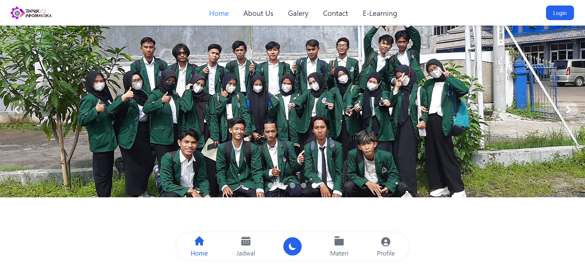
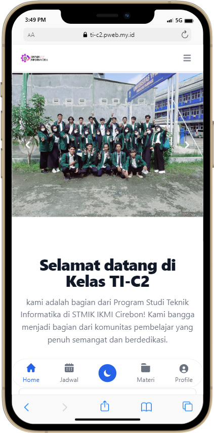

# Penjelasan singkat tentang website ini

## Tentang project
Pada project ini, saya membuat website Kelas TI-C2 ini sebagai project latihan dan berguna juga untuk menampilkan album foto kelas saya serta dapat memudahkan melihat jadwal perkuliahan. Saya membuat website ini menggunakan HTML, CSS, JS, Flowbite, dan Tailwind. Website ini juga sudah responsif❗️

## Link Demo
https://ti-c2.pweb.my.id

## Screenshot
Berikut adalah screenshot project saya:

### Tampilan dekstop
 

### Tampilan mobile

# Akhir kata
Dikembangkan oleh 
([@azharangga_kusuma](https://instagram.com/azharangga_kusuma))
